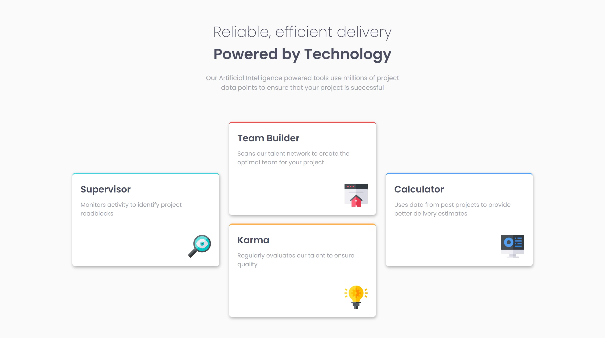

# Frontend Mentor - Four card feature section solution

This is a solution to the [Four card feature section challenge on Frontend Mentor](https://www.frontendmentor.io/challenges/four-card-feature-section-weK1eFYK).

### Screenshot

### Links

- Live Site URL: [Click here](https://jamilpl.github.io/four-card-feature-section/)

### Built with

- HTML5
- CSS
- CSS Grid
- Mobile-first

## Author

- Frontend Mentor - [@jamilpl](https://www.frontendmentor.io/profile/jamilpl)
